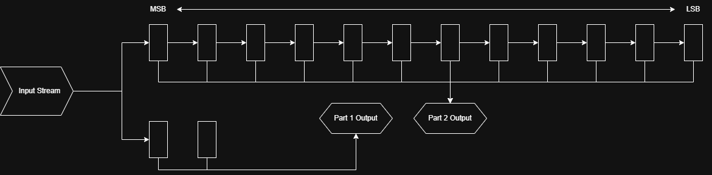

# Advent of FPGA 2025 - Hardcaml Solutions

This repository contains my solutions for [Jane Street's Advent of FPGA 2025](https://blog.janestreet.com/advent-of-fpga-challenge-2025/) challenge.

## About

I have never used OCaml or Hardcaml before, though I do have some experience with other HDLs. I am using this challenge as an opportunity to learn both OCaml/Hardcaml and to improve my architecture skills.

## Project Layout

The project is structured with each day's circuit in its own folder within `src/`.

*   `src/DayX/`: Contains the solution for Day X.
    *   `hardware.ml`: The actual hardware implementation of the circuit. Also includes tests for the circuit
    *   `main.ml`: Handles input parsing and runs the hardware simulation against the input.
*   `inputs/`: Contains the input files for the challenges.

## Solutions

### Day 1

[Problem](https://adventofcode.com/2025/day/1) | [Solution](src/Day1/hardware.ml)

This was my first time making any non-trivial Hardcaml circuit, so I spent a lot of time getting the basics of file format, structure, and testing working. My initial approach only handled numbers in the range [0, 200], and took a single cycle for each input. To make it work with larger inputs, I switched to a state machine and repeated subtracted 100 until it's in this range. Short of implementing modular arithmetic, I'm happy with this solution.

**Performance**: Executes in 12208 cycles (~2.93 per line).

### Day 2

[Problem](https://adventofcode.com/2025/day/2) | [Solution](src/Day2/hardware.ml)

I used a multiphase approach for day two. After reciving the input, I extract the decimal digits using the Double Dabble algorithm, check for equality among all relevant sets of chunks, and then increment with a ripple add operation.

Implementing the equality check was the most interesting part of this circuit. For each length 1 through 16, I use a recursive function to find the factors. I then use two left fold operations to first check if all of the chunks have the same value for a given chunk size, then to see if any chunk size meets the requirement for each length. These would all be computed in parallel in hardware, then a mux with the number of digits is used to get the result.

**Performance**: Executes in 4963923 cycles (~2.00 per number checked).

### Day 3

[Problem](https://adventofcode.com/2025/day/3) | [Solution](src/Day3/hardware.ml)

This is my favorite circuit so far! My reference python implementation iterated over each of the output digits for each input character, which would be somewhat inefficient and didn't feel in the spirit of an FPGA. Instead, I initialize a processor for each digit, and the characters are passed through them from the MSB to the LSB. This means with sufficiently long input strings we'd approach one cycle per character!



I'm also quite happy with how this approach generalized -- part 1 and part 2 use the same exact approach, part 1 with a chain of 2 processors and part 2 with a chain of 12.

**Performance**: Executes in 22800 cycles (114 per line, 1.14 per character)

### Day 4 (Part 1 Only)

[Problem](https://adventofcode.com/2025/day/4) | [Solution](src/Day4/hardware.ml)

Day 4 was the first problem where I only decided to solve one of the parts. I may come back to this with a brute force approach for part 2, since my optimized approach seems difficult to translate to an FPGA.

Since the first part only has dependencies of length `w` for a `w x h` grid, I was able to create a circuit which only uses `O(w)` memory and about `w * h` cycles. The input to the circuit is a left to right, top to bottom stream of characters straight from the file. The core idea is to allocate a size `w` ram which stores the state of the previous `w` cells, specifically 1 bit for if it's occupied and 4 bits for the known number of neighbors. Each new cell we read both updates it's earlier neighbors and reads from them to determine it's initial number of neighbors.

The circuit came together pretty quickly, but there were several hours of debugging hell to deal with off by one errors, register/ram timing issues, flushing, and handling boundary cases. I'm very happy with the result though, and I doubt it could be significantly improved for a 1-character-at-a-time streaming input.

**Performance** Executes in 19185 cycles (~1.007 character)

## Usage

### Setup
Assuming you already have OCaml installed, create a switch with `opam switch create hardcaml 5.2.1` then run `opam install hardcaml ppx_hardcaml hardcaml_waveterm`

### Running Tests

You can run the tests for a specific day using `dune test`. For example, to test Day 1:

```bash
dune test src/Day1# aoc-hardcaml
```

### Running the solution
To run the solution against the input file, use `dune exec`. For example, for Day 1:
```bash
dune build
dune exec day1
```